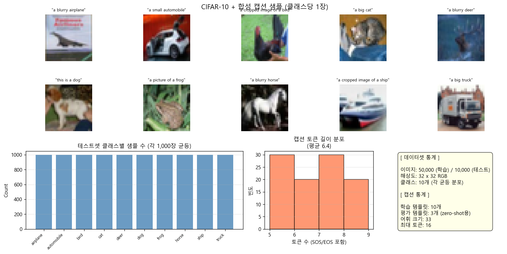
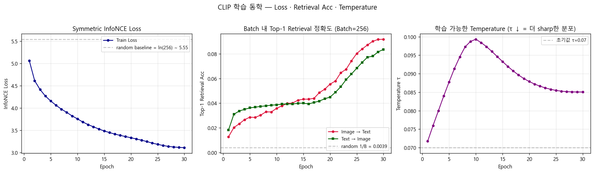
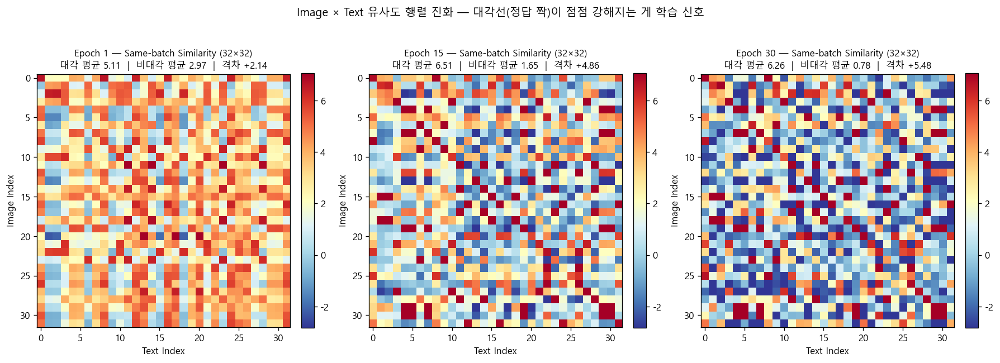
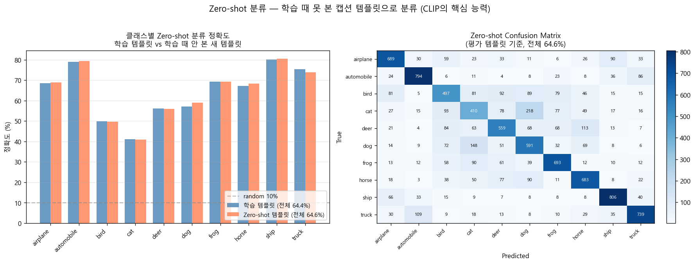
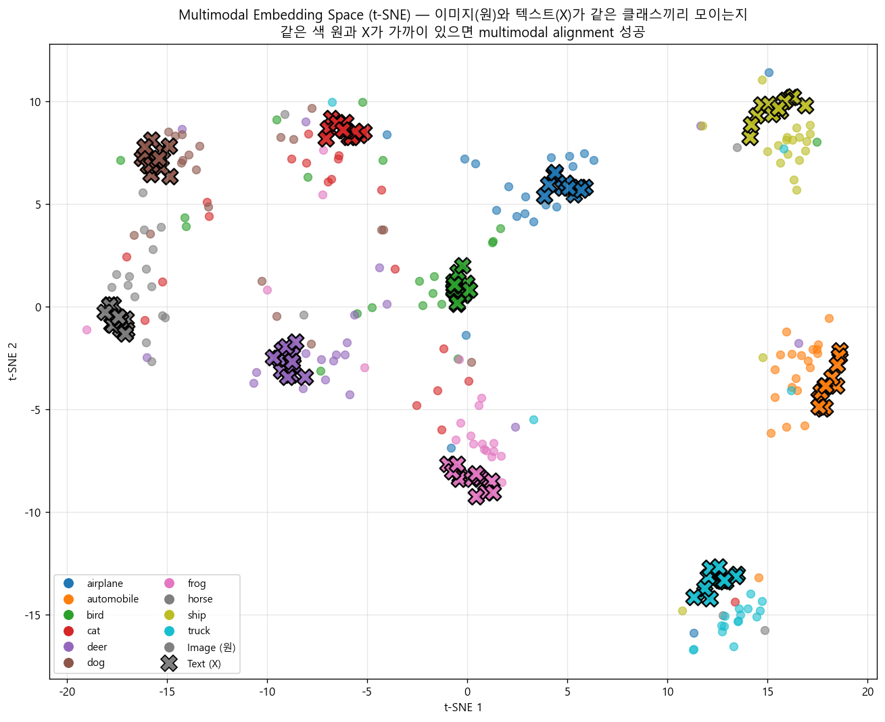
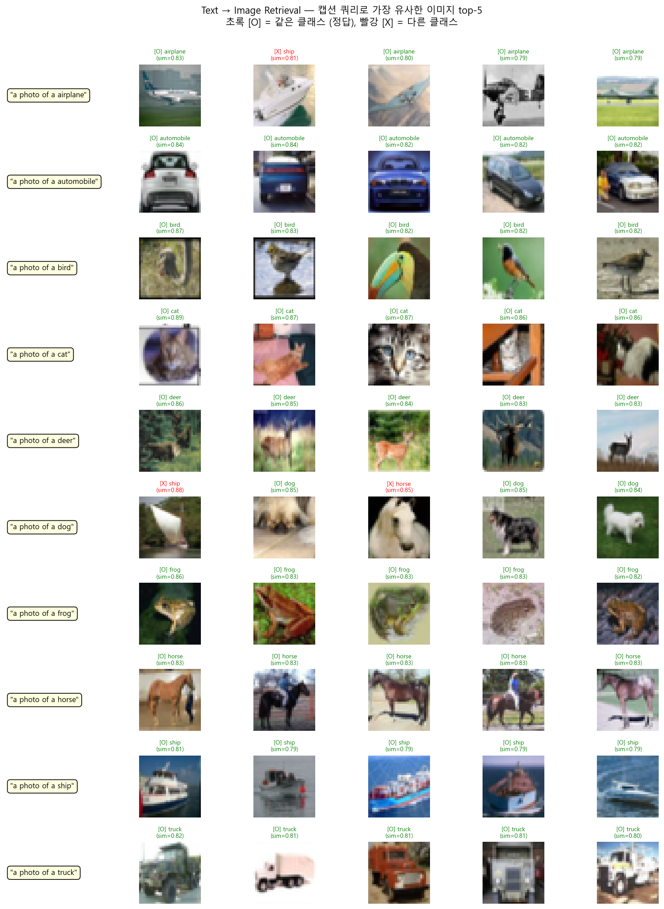

# 🔗 CLIP from Scratch — Contrastive Language-Image Pre-training in PyTorch
### CIFAR-10 이미지와 합성 캡션을 같은 임베딩 공간에 정렬하는, PyTorch로 직접 구현한 미니 CLIP.


---

## 📌 프로젝트 요약 (Project Summary)

**CLIP (Contrastive Language-Image Pre-training)** 을 PyTorch로 직접 구현한 프로젝트입니다. CLIP의 핵심 아이디어는 *"같은 의미를 가진 이미지와 텍스트는 같은 공간의 비슷한 위치로 보내자"* 인데, 이 한 줄을 InfoNCE 손실 함수로 풀어내는 과정을 코드로 직접 짜보면서 익히는 것이 1차 목표였습니다. 직전 두 프로젝트인 [vae-from-scratch](https://github.com/AD-Styles/vae-from-scratch)와 [gan-from-scratch](https://github.com/AD-Styles/gan-from-scratch)는 둘 다 이미지 한 종류만 다루는 생성 모델이었는데, 이번에는 처음으로 **이미지와 텍스트 두 종류를 같이 다루는 멀티모달 모델**을 짜본다는 점이 달랐습니다.

이번 프로젝트의 특징은 **이전 from-scratch 프로젝트들의 부품을 직접 합쳐 만들었다는 점**입니다. Image Encoder는 [resnet-from-scratch](https://github.com/AD-Styles/resnet-from-scratch)의 `BasicBlock` 으로 만든 ResNet-20을 그대로 가져왔고, Text Encoder는 [transformer-from-scratch](https://github.com/AD-Styles/transformer-from-scratch)의 `EncoderLayer` 를 4층 쌓아 구성했습니다. 두 인코더가 뽑아낸 출력을 같은 256차원 공간에 매핑하고, Symmetric InfoNCE 손실 함수로 정렬시키는 게 이번 프로젝트의 학습 핵심입니다.

데이터셋은 **CIFAR-10 (32×32 RGB, 50K)** 을 썼고, 클래스명에 `"a photo of a {cls}"`, `"a blurry {cls}"` 같은 10가지 문장 양식을 적용해서 캡션을 만든 다음 이미지와 짝지어 학습시켰습니다. 학습 후에는 학습 곡선, 유사도 행렬 진화, 학습 때 안 본 새 템플릿으로 zero-shot 분류, multimodal 임베딩 공간 t-SNE, text→image retrieval까지 데이터셋 개요를 포함해 총 6개의 시각화로 정리했습니다. 학습 안 한 평가 템플릿으로도 **zero-shot 분류 정확도 64.6%** (random 10% 대비)가 나와서, 모델이 단순히 캡션을 외운 게 아니라 실제로 의미를 학습했다는 게 확인됐습니다.

---

## 📂 프로젝트 구조 (Project Structure)

```
clip-from-scratch/
├── results/
│   ├── 01_dataset_overview.png         # CIFAR-10 샘플 + 합성 캡션 + 어휘 통계
│   ├── 02_training_curve.png           # InfoNCE Loss · Retrieval Acc · Temperature τ (∩자 곡선)
│   ├── 03_similarity_evolution.png     # 유사도 행렬 진화 — 대각선이 점점 강해지는 과정
│   ├── 04_zero_shot.png                # 학습 양식 vs Zero-shot 양식 정확도 (64.4% vs 64.6%) + Confusion Matrix
│   ├── 05_embedding_space.png          # Multimodal Embedding Space (t-SNE) — 같은 클래스 이미지·텍스트가 모이는지
│   └── 06_retrieval_examples.png       # Text → Image Retrieval top-5 (캡션 쿼리로 이미지 검색)
├── src/
│   └── main.py                         # CLIP 모델 + 학습 루프 + 시각화 통합 스크립트
├── .gitignore
├── LICENSE
├── README.md
└── requirements.txt
```

---

## 🧩 핵심 개념 (Key Concepts)

| 개념 | 한 줄 설명 |
|------|-----------|
| **대조 학습 (Contrastive Learning)** | 같은 짝(positive)은 가깝게, 다른 짝(negative)은 멀게 — CLIP의 핵심 학습 원리 |
| **공유 임베딩 공간 (Joint Embedding Space)** | 이미지와 텍스트를 같은 256차원 공간에 매핑 — 두 모달의 직접 비교를 가능케 함 |
| **정보 대조 손실 (InfoNCE Loss)** | 배치 N×N 유사도 행렬의 대각선(정답 짝)을 양성으로 보는 cross-entropy. image→text + text→image 평균이 Symmetric InfoNCE |
| **학습 가능한 온도 τ (Learnable Temperature τ)** | 유사도 분포의 날카로움(sharpness)을 조절하는 학습 가능한 스칼라 — 학습 진행에 따라 ∩자로 적응 |
| **제로샷 분류 (Zero-shot Classification)** | 학습 때 못 본 캡션 양식으로 분류 — CLIP의 핵심 능력을 검증하는 지표 |

---

## 🏗️ 모델 구조 (Model Architecture)

```
이미지 분기:                              텍스트 분기:
[ Image (3 × 32 × 32) ]                  [ Caption "a photo of a cat" ]
   ↓                                          ↓
┌─────────────────────────────────┐      [ Tokenizer (word-level, vocab 33) ]
│  Image Encoder (ResNet-20)      │           ↓
│   ├ Conv 3 → 16                 │      [ Token Embedding + Positional Encoding ]
│   ├ Stage 1: 3 × BasicBlock(16) │           ↓
│   ├ Stage 2: 3 × BasicBlock(32) │      ┌─────────────────────────────────┐
│   ├ Stage 3: 3 × BasicBlock(64) │      │  Text Encoder (Transformer)     │
│   └ Global Avg Pool → 64-dim    │      │   ├ EncoderLayer × 4            │
│                                 │      │   │   (8 heads × d_k=32)        │
│ → Projection: Linear(64 → 256)  │      │   └ Mean Pool (PAD 제외)        │
└─────────────────────────────────┘      │                                 │
   ↓                                     │ → Projection: Linear(256 → 256) │
[ L2 Normalize ]                         └─────────────────────────────────┘
   ↓                                          ↓
image_embedding (256-dim)                [ L2 Normalize ]
                                              ↓
                                         text_embedding (256-dim)

   ↓                                          ↓
   └──────────────┬───────────────────────────┘
                  ↓
         [ Similarity Matrix = img_emb @ txt_emb.T × exp(logit_scale) ]
                  ↓
         [ Symmetric InfoNCE Loss ]
            (image→text CE + text→image CE) / 2
```

| Component | 차원 / 설정 |
|-----------|------------|
| Image encoder | ResNet-20 (6n+2, n=3, input 3×32×32) — [resnet-from-scratch](https://github.com/AD-Styles/resnet-from-scratch)의 `BasicBlock` 재활용 |
| Text encoder | 4-layer Transformer Encoder (word-level tokens, max length 16, 8 heads × d_k=32, d_ff=1024) — [transformer-from-scratch](https://github.com/AD-Styles/transformer-from-scratch)의 `EncoderLayer` 재활용 |
| Embed dim | 256 (이미지·텍스트 공유 공간) |
| Loss | Symmetric InfoNCE (유사도 행렬에 대한 multi-class Cross-Entropy) |
| Training | AdamW (lr=5e-4, weight_decay=0.2, betas=(0.9, 0.98)) + Linear warmup 1 epoch → Cosine decay |
| Temperature τ | Learnable parameter, init 0.07 (`logit_scale = log(1/τ)`) |
| **Encoder params** | **Image 0.29 M / Text 3.23 M** |
| **Total params** | **3.52 M** |

---

## 📊 학습 결과 (Training Results)

RTX 4060에서 **30 epochs** 학습 진행 (batch 256, CIFAR-10 50K 샘플). 4개 지표(InfoNCE Loss, Image→Text Acc, Text→Image Acc, Temperature τ)로 학습 추이를 기록.

| Epoch | Loss | i2t Acc | t2i Acc | τ | 비고 |
|-------|------|---------|---------|---|------|
| 1   | 5.06 | 0.013 | 0.018 | 0.072 | 초반 — random ln(256)=5.55 근처 |
| 5   | 4.16 | 0.029 | 0.036 | 0.088 | Loss 빠르게 감소 |
| 10  | 3.76 | 0.036 | 0.039 | 0.099 | τ 최대점 — 분포 가장 부드러움 |
| 15  | 3.49 | 0.043 | 0.040 | 0.093 | 중반 — snapshot 저장 |
| 20  | 3.33 | 0.055 | 0.045 | 0.088 | retrieval 정확도 가속 시작 |
| 25  | 3.18 | 0.080 | 0.068 | 0.086 | 후반 급가속 |
| **30** | **3.11** | **0.092** | **0.084** | **0.085** | **최종** |

**핵심 관찰 (Key Observations)**

- **Loss 38% 감소** — random baseline ln(256)≈5.55 근처에서 시작해 epoch 30에서 3.11. 이미지·텍스트가 같은 공간에 정렬되어 갈수록 정답 짝과 오답 짝의 유사도 격차가 벌어졌다는 뜻
- **Temperature τ가 V자가 아니라 ∩자 곡선** — 0.072 → 0.099 (epoch 10) → 0.085로 정점 후 다시 내려감. 학습 초반엔 분포를 부드럽게 펼치다가, 정렬이 잡힌 후반에는 다시 sharp하게 만들어 정답에 확신을 높이는 패턴
- **Zero-shot 분류 정확도 64.61%** — 학습 때 본 적 없는 평가 템플릿(`"the {cls}"`, `"a {cls} in the scene"`, `"a colorful {cls}"`)으로 분류한 결과. random 10% 대비 6배 이상, 학습 템플릿 정확도(64.44%)와 거의 동일 → **단순한 캡션 암기가 아니라 multimodal alignment를 학습했다는 직접 증거**
- **Batch 내 retrieval 정확도가 ~9% 부근** — 작아 보이지만 random 1/256=0.39% 대비 약 23배. 다만 같은 배치에 동일 캡션이 여러 번 반복 등장하는 구조라 (10 템플릿 × 10 클래스 = 유니크 캡션 100개, batch 256으로 샘플링 → 평균 2.5개 중복), 정답이 여러 개라 해석이 모호한 지표. 실제 능력 측정은 zero-shot 정확도가 더 정확

---

## 🔍 시각화 결과 분석 (Visualization Analysis)

### 1. Dataset Overview (데이터셋 개요)



CIFAR-10 (32×32 RGB, 10개 클래스 × 5,000장 균등 (학습) / 1,000장 (테스트))에 클래스별로 10개씩 합성 캡션을 부착했습니다. 캡션 토큰 길이는 평균 6.4 (SOS/EOS 포함), 어휘 크기는 33개로 매우 작은 편입니다. 어휘를 작게 유지한 건 의도적인데, CLIP의 **InfoNCE 학습 자체에 집중**하기 위해서이고 토크나이저나 어휘 크기는 학습 핵심에 영향을 주지 않기 때문입니다.

학습용 템플릿 10가지(`"a photo of a {cls}"`, `"a blurry {cls}"`, `"a cropped image of a {cls}"` 등)와 평가용 템플릿 3가지(`"the {cls}"`, `"a {cls} in the scene"`, `"a colorful {cls}"`)를 분리해서, 평가 템플릿은 학습 때 단 한 번도 모델에 노출되지 않게 했습니다. 이게 zero-shot 평가의 핵심 전제입니다.

<br>

### 2. Training Dynamics — Loss · Retrieval Acc · Temperature (학습 동학)



3개 지표가 한눈에 보이는 그림이고, 각각 독립적인 이야기를 합니다.

- **(좌) InfoNCE Loss** — 5.06에서 시작해 random baseline ln(256)=5.55 바로 아래에서 출발했습니다. 학습이 진행되면서 단조감소해 epoch 30에서 3.11에 도달. VAE의 ELBO처럼 깔끔하게 떨어지는 곡선인데, GAN의 줄다리기와 정반대 — Contrastive Loss는 구조적으로 안정적인 학습 신호
- **(중) Top-1 Retrieval Acc** — 초반엔 Text→Image(초록)가 약간 더 높다가 epoch 12 부근에서 교차하고, 후반(epoch 18~)에 Image→Text(빨강)가 빠르게 추월. 학습이 진행되면서 이미지에서 텍스트를 찾는 게 약간 더 쉬운 방향이 된다는 작은 신호. random 0.0039 대비 9% 부근 도달
- **(우) Learnable Temperature τ** — 0.072에서 시작해 epoch 10에서 0.099로 최대, 그 후 다시 내려가 0.085에 안착. **τ는 학습 초반에 분포를 더 부드럽게 만들었다가, 정렬이 잡힌 후 분포를 다시 sharp하게 좁혀가는 ∩자 곡선**을 그림. CLIP 논문에서 학습 가능한 τ가 안정성을 높인다고 했는데, 이 패턴이 그 효과를 직접 보여줍니다

<br>

### 3. Similarity Matrix Evolution — 대각선이 강해지는 학습 신호



**이번 프로젝트의 시그니처 시각화**입니다. 같은 32×32 배치(고정)의 이미지×텍스트 유사도 행렬을 epoch 1 / 15 / 30 시점에 각각 그렸습니다. CLIP의 학습 신호가 정확히 무엇인지 한 그림으로 설명됩니다.

| Epoch | 대각 평균 | 비대각 평균 | 격차 |
|-------|---------|----------|------|
| 1   | 5.11 | 2.97 | **+2.14** |
| 15  | 6.51 | 1.65 | **+4.86** |
| 30  | 6.26 | 0.78 | **+5.48** |

- **Epoch 1**: 전체적으로 빨강(높은 유사도)이 많이 보임. 모델이 거의 모든 쌍에 비슷한 점수를 매기는 상태. 격차 +2.14는 너무 약함
- **Epoch 15**: 대각선이 빨갛게 살아나고 비대각이 파랗게 식기 시작. 격차 +4.86으로 2.3배 벌어진 상태
- **Epoch 30**: 비대각이 거의 다 파랑(낮은 유사도), 대각만 빨강을 유지. 격차 +5.48까지 벌어짐 → **InfoNCE가 의도한 그대로의 학습 결과**

대각선 자체는 약간 줄었지만(6.51→6.26), 비대각이 훨씬 크게 줄어든(1.65→0.78) 게 핵심. 결국 정답 쌍을 절대적으로 더 높이는 게 아니라, **상대적으로 다른 쌍보다 두드러지게 만드는 것**이 contrastive learning의 핵심이라는 게 그대로 보입니다.

<br>

### 4. Zero-shot Classification (학습 때 안 본 템플릿으로 분류)



**CLIP의 핵심 능력을 검증하는 지표**입니다. 학습 때 사용한 10가지 템플릿으로 만든 클래스 임베딩으로 분류한 정확도와, **학습 때 한 번도 안 본 3가지 새 템플릿**(`"the {cls}"`, `"a {cls} in the scene"`, `"a colorful {cls}"`)으로 만든 임베딩으로 분류한 정확도를 비교했습니다.

**(좌) 클래스별 정확도 비교**

- 학습 템플릿 전체: **64.44%**
- Zero-shot 템플릿 전체: **64.61%**
- → 거의 동일. 모델이 단순히 학습 템플릿을 외운 게 아니라 *"클래스별로 깔끔하게 정리된 의미 공간"*을 만들었다는 직접 증거
- 클래스별 격차: Ship 80.6% / Automobile 79.5% / Truck 74.0% (높음) ↔ Cat 41.0% / Bird 49.5% (낮음)
- 잘 되는 클래스는 *형태가 일관되고 배경 대비가 큰 카테고리* (탈것, frog·horse 같이 형태가 독특한 동물)

**(우) Zero-shot Confusion Matrix**

- 대각선이 압도적이지만 몇 군데 굵은 비대각 셀이 눈에 들어옴
- **Cat → Dog 218건** (가장 큰 오분류) — 32×32 해상도에서 작은 동물의 형태가 비슷해서 발생하는 자연스러운 혼동
- **Deer → Horse 113건**, **Dog → Cat 148건** — 형태가 비슷한 동물 쌍에서 일관되게 혼동
- **Truck → Automobile 109건** — 차량 카테고리 안에서의 미세 분류 어려움
- 32×32 해상도의 한계가 다 보이는 패턴 (사람이 봐도 cat과 dog 구분이 어려운 경우 많음)

<br>

### 5. Multimodal Embedding Space — t-SNE (다중모달 임베딩 공간)



256차원 임베딩 공간을 t-SNE로 2D에 투영했습니다. 클래스당 이미지 20장(○)과 모든 캡션 템플릿 13개(X 표시, 학습+평가 합쳐서)를 함께 그렸습니다.

- **같은 클래스의 이미지(○)와 텍스트(X)가 같은 색으로 클러스터를 이루는 모습** — multimodal alignment가 성공적으로 일어났다는 결정적 증거
- X 마커는 거의 항상 같은 색 ○ 클러스터의 가까이에 위치 — 텍스트 임베딩이 이미지 임베딩과 의미적으로 가까운 위치로 학습된 결과
- 일부 클래스(cat, bird, deer, dog 같이 자연 카테고리)는 클러스터 경계가 다소 흐림 — 04번에서 본 confusion 패턴과 일치
- 탈것 카테고리(ship, truck, automobile, airplane)는 서로 잘 분리되어 있음

→ 만약 alignment가 실패했다면 X 마커들이 ○ 클러스터와 무관한 위치에 흩어져 있었을 텐데, 한 그림으로 검증됩니다.

<br>

### 6. Text → Image Retrieval (캡션 쿼리로 이미지 검색)



각 클래스별로 `"a photo of a {cls}"` 쿼리를 던지고, 테스트셋 5,000장(10K 중 일부) 중 유사도 top-5 이미지를 검색한 결과입니다. 정답(쿼리와 같은 클래스)은 초록 [O], 오답은 빨강 [X]로 표시.

- **잘 되는 쿼리**: ship, automobile, truck, airplane, bird, frog, horse — top-5에 거의 모두 정답
- **어려운 쿼리**: cat·deer·dog — 32×32에서 형태가 비슷한 동물끼리 섞임
- **흥미로운 패턴**: 오답이라도 *시각적으로 비슷한* 이미지가 들어옴 (cat 쿼리에 dog, deer 쿼리에 horse 등)

→ 이 결과가 **CLIP의 실용적 활용 방식**(이미지 검색, 라벨 없는 데이터 분류 등)을 그대로 보여줍니다. 검색이 단순 텍스트 매칭이 아니라 *의미적 매칭* 으로 동작한다는 게 핵심.

---

## 💡 회고록 (Retrospective)

직전 프로젝트인 gan-from-scratch까지는 이미지 한 종류 안에서 분포를 학습하는 일이었는데, CLIP으로 넘어오면서 처음 부딪힌 게 *"이미지와 텍스트라는 서로 다른 두 종류를 어떻게 같은 공간에 합치느냐"* 였습니다. 두 인코더 출력을 같은 256차원에 던져두고, 손실 함수 하나로 "비슷한 짝은 가까이, 다른 짝은 멀리" 라는 게 되도록 학습시키는 발상이 처음엔 너무 단순해서 의심스러웠습니다. 실제로 코드로 짜보니 정말 그게 다였고, 손실 함수 한 줄(`(CE(sim, eye) + CE(sim.T, eye)) / 2`)이 알아서 두 인코더를 정렬시켜준다는 게 신기했습니다.

이번 작업에서 인상적이었던 건 이전 프로젝트들의 부품을 그대로 재활용할 수 있다는 점이었습니다. Image Encoder는 [resnet-from-scratch](https://github.com/AD-Styles/resnet-from-scratch)의 `BasicBlock` 을 거의 그대로 가져와서 ResNet-20을 만들었고, 마지막 FC만 256-dim projection으로 바꾸면 됐습니다. Text Encoder는 [transformer-from-scratch](https://github.com/AD-Styles/transformer-from-scratch)의 `EncoderLayer` 를 4층 쌓고 mean pooling만 추가했습니다. 두 프로젝트 짤 때는 각자 독립적인 학습이었는데, 이번에 두 부품을 합쳐 본격적인 멀티모달 모델이 만들어지니까 시리즈가 누적되어 가는 느낌이 처음으로 들었습니다.

구현하면서 한참 막혔던 건 batch 크기와 contrastive learning의 관계였습니다. 이론적으로 negative sample이 많을수록 학습이 잘 된다고 들었는데, 실제로 짜보면서 *"배치 안에 정답이 여러 개면 어쩌나"* 하는 의문이 생겼습니다. 합성 캡션이라 100가지 유니크 캡션만 있는데 batch 256이면 평균 2.5개씩 같은 캡션이 들어가게 됩니다. 이게 retrieval 정확도가 9% 부근에 머무는 이유였습니다 — 같은 캡션이 여러 인덱스에 등장하니 "정답 인덱스 하나"라는 가정이 깨지는 거였습니다. 결국 *이런 모호한 상황에서도 InfoNCE는 작동하긴 하지만, 평가는 다른 방식으로 해야 한다*는 걸 깨달았고, zero-shot 분류로 평가 지표를 바꿨습니다.

학습 가능한 temperature τ가 ∩자 곡선을 그리는 것도 예상 밖이었습니다. 처음엔 학습이 진행될수록 τ가 단조감소할 거라고 예상했는데(분포를 점점 sharp하게), 실제로는 0.072 → 0.099 → 0.085로 한 번 올라갔다가 내려옵니다. 가만 생각해보니 초반엔 모델이 아직 잘 정렬되지 않아서 *모든 쌍에 어느 정도 확률을 분배해야* 학습 신호가 안정적이고, 후반에 정렬이 잡힌 뒤에야 *정답에 집중해 sharp하게 좁히는* 게 자연스러운 흐름이었습니다. 학습 가능한 τ가 단순히 안정화 트릭이 아니라 학습 진행에 맞춰 적응하는 장치라는 게 보였습니다.

이번 프로젝트에서 직접 짜보길 잘했다 싶었던 게 zero-shot 분류 결과였습니다. 학습 때 본 10가지 템플릿 정확도가 64.4%, 학습 때 한 번도 안 본 새 템플릿 3가지로 만든 임베딩의 정확도가 64.6%. 차이가 0.2%p에 불과합니다. **모델이 단순히 "이 캡션은 이 클래스"라고 외운 게 아니라, 캡션의 의미를 추상화해서 클래스의 의미 공간을 만들었다**는 직접 증거였습니다. 책에서 "CLIP은 zero-shot이 강하다" 라고만 읽었던 게 64.4% vs 64.6%라는 두 숫자로 확인되니까 인상이 완전히 달랐습니다.

03번 시각화에서 유사도 행렬이 epoch 1에서 30으로 가면서 변하는 모습이 인상 깊었습니다. 격차가 +2.14에서 +5.48로 벌어지는데, 자세히 보면 대각선 자체는 5.11에서 6.26으로 약간 올라간 게 다이고, 정작 비대각이 2.97에서 0.78로 훨씬 크게 떨어졌습니다. 정답 쌍을 절대적으로 더 가깝게 만드는 게 아니라 *"오답 쌍을 멀리 밀어내는 게 학습의 핵심"* 이라는 걸 그림 하나로 깨달았습니다. contrastive라는 이름 그대로의 결과였습니다.

아쉬운 점도 있습니다. CIFAR-10은 32×32라 cat과 dog가 사람 눈에도 구분이 어려운 경우가 많고, confusion matrix에서 cat→dog 218건, dog→cat 148건 같은 큰 혼동이 보였습니다. ImageNet이나 Flickr 같은 자연 이미지 데이터셋으로 가면 더 그럴듯한 결과가 나올 것 같은데, 다음 단계로 남겨둡니다. 또 vocab 33은 너무 단순한 토크나이저라 진짜 자유 텍스트(예: "a brown dog playing in the park")는 표현 못 합니다. BPE 같은 sub-word 토크나이저로 확장하면 진짜 자연 텍스트와의 정렬이 가능할 것 같습니다.

다음에는 이 CLIP의 텍스트 인코더를 [diffusion-models-from-scratch](https://github.com/AD-Styles/diffusion-models-from-scratch)와 [vae-from-scratch](https://github.com/AD-Styles/vae-from-scratch)와 합쳐서 **Stable Diffusion 미니버전**을 만들어보고 싶습니다. CLIP 텍스트 인코더 + VAE 인코더 + Diffusion U-Net + Cross-Attention. 이번에 CLIP을 짜본 게 그 방향으로 가는 다리가 됐고, from-scratch 시리즈가 한 곳으로 이어지는 게 보이기 시작했습니다.

---

## 🔗 참고 자료 (References)

### 핵심 논문

- Radford et al., *Learning Transferable Visual Models From Natural Language Supervision (CLIP)* (ICML 2021) — [arXiv:2103.00020](https://arxiv.org/abs/2103.00020)
- Vaswani et al., *Attention Is All You Need* (NeurIPS 2017) — [arXiv:1706.03762](https://arxiv.org/abs/1706.03762)
- He et al., *Deep Residual Learning for Image Recognition* (CVPR 2016) — [arXiv:1512.03385](https://arxiv.org/abs/1512.03385)
- van den Oord et al., *Representation Learning with Contrastive Predictive Coding (InfoNCE)* (2018) — [arXiv:1807.03748](https://arxiv.org/abs/1807.03748)
- Chen et al., *A Simple Framework for Contrastive Learning of Visual Representations (SimCLR)* (ICML 2020) — [arXiv:2002.05709](https://arxiv.org/abs/2002.05709)

### 데이터셋 / 레퍼런스 구현

- Krizhevsky, *Learning Multiple Layers of Features from Tiny Images (CIFAR-10/100)* (2009) — [Dataset](https://www.cs.toronto.edu/~kriz/cifar.html)
- OpenAI CLIP — [GitHub](https://github.com/openai/CLIP)
- OpenCLIP (재구현 + 학습 코드) — [GitHub](https://github.com/mlfoundations/open_clip)

### 블로그 / 해설

- Lilian Weng, *Contrastive Representation Learning* — [blog](https://lilianweng.github.io/posts/2021-05-31-contrastive/)
- *Simple Implementation of OpenAI CLIP model: A Tutorial* (Towards Data Science) — [tutorial](https://towardsdatascience.com/simple-implementation-of-openai-clip-model-a-tutorial-ace6ff01d9f2/) | 학습용 CLIP 구현 해설
- Yannic Kilcher, *CLIP: Connecting Text and Images* — [YouTube](https://www.youtube.com/watch?v=T9XSU0pKX2E)

### 시리즈 연결

- [transformer-from-scratch](https://github.com/AD-Styles/transformer-from-scratch) — Text Encoder의 `EncoderLayer` 부품 출처
- [resnet-from-scratch](https://github.com/AD-Styles/resnet-from-scratch) — Image Encoder의 `BasicBlock` 부품 출처
- [gan-from-scratch](https://github.com/AD-Styles/gan-from-scratch) — 직전 생성 모델 시리즈
- [vae-from-scratch](https://github.com/AD-Styles/vae-from-scratch) — 다음 단계 latent diffusion의 VAE 인코더로 통합 예정
- [diffusion-models-from-scratch](https://github.com/AD-Styles/diffusion-models-from-scratch) — 다음 단계 Stable Diffusion 미니에서 통합 예정
